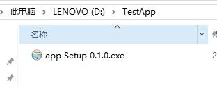
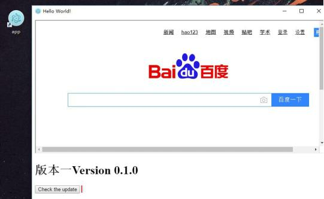
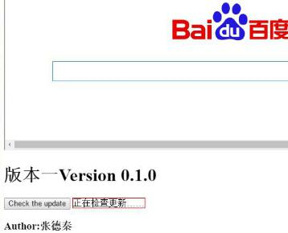
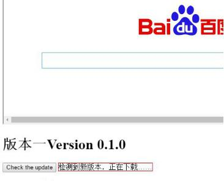
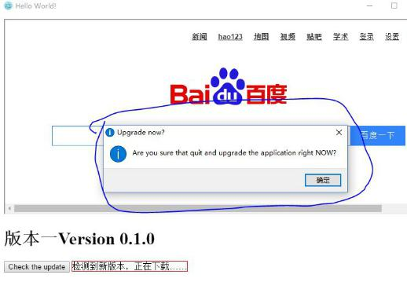
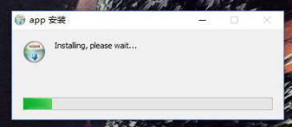
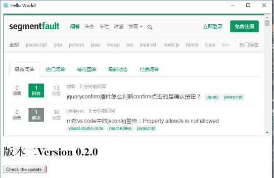

# 通过electron封装客户端，并实现自我更新机制
electron封装客户端升级说明
点击此网址http://version1.oss-cn-beijing.aliyuncs.com/app%20Setup%200.1.0.exe可下载版本一的windows安装包，您可以亲自验证程序功能。源代码网址：https://github.com/PinkieClain/Test1
本功能的实现有两个重点问题，第一是将文件封装为方便分发的客户端，第二是实现客户端的自我更新机制。对于第一项，我使用了electron-builder模块来进行封装。第二项通过autoupdater实现。
此客户端功能实现结果展示如下：
1.将版本一（v0.1.0）文件封装为nsis可安装.exe文件。点击exe文件安装版本一

2.安装完成后桌面会出现客户端的启动快捷图标，并且客户端会自动启动

3.页面分为两个框架。上方框架含有最基本的版本信息，以及检查更新按钮。点击Check the update按钮，程序开始检查更新。

4 .通过存放在服务器的latest文件，得知服务器存在新版本，程序开始自动下载新版本

5 .下载完成后程序弹出对话框，询问用户是否需要现在重启程序，完成更新。

6 .点击“确定”，程序退出并安装新版本。安装完成后软件自动重启。此时软件为版本二（v0.2.0）

     在此例中，客户端封装比较简单，且方式多样，有electron-packager这样的第三方打包工具，也有其自带的打包方式。考虑到后面需要实现的自动更新功能，我采用了electron-builder第三方打包工具。选择它的原因是build不仅仅可以将文件打包为nsis可执行安装文件，同时还生成latest.yml文件，可以通过它来检查更新。